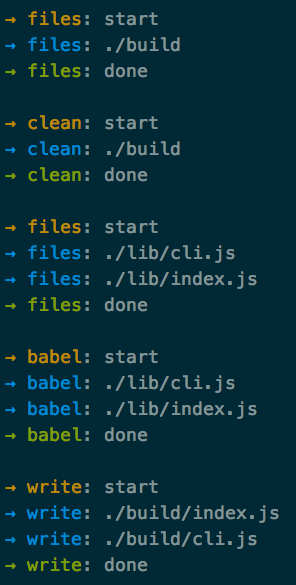

# start-pretty-reporter

[](https://www.npmjs.com/package/start-pretty-reporter)
[](https://travis-ci.org/start-runner/pretty-reporter)
[](https://codecov.io/github/start-runner/pretty-reporter)
[](https://gemnasium.com/start-runner/pretty-reporter)
[](https://gitter.im/start-runner/start)

Pretty reporter for [Start](https://github.com/start-runner/start).

* colors
* decamelized task names
* short relative paths
* clean stack traces



## Install

```
npm i -S start-pretty-reporter
```

## Usage

```js
import start from 'start';
import reporter from 'start-pretty-reporter';
import files from 'start-files';
import clean from 'start-clean';
import read from 'start-read';
import babel from 'start-babel';
import write from 'start-write';

export function build() {
    return start(reporter())(
        files('build/'),
        clean(),
        files('lib/**/*.js'),
        read(),
        babel(),
        write('build/')
    );
}
```

See [documentation](https://github.com/start-runner/start#readme) for details.

## Arguments

`reporter(options)`

* `options` – reporter options, `{ mute: [] }` by default
  * `mute` – array of task names to mute any output
